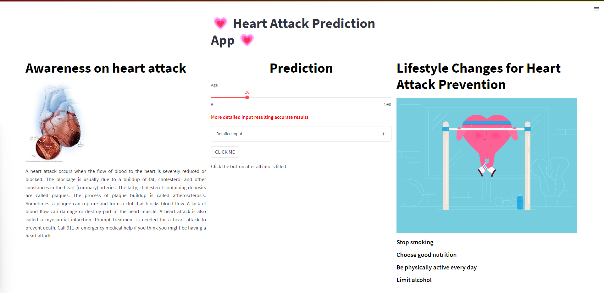
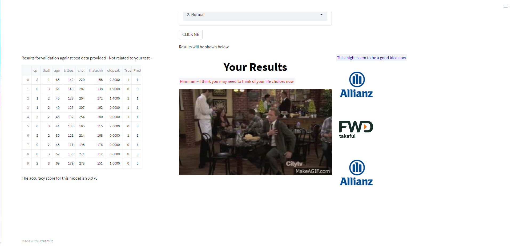
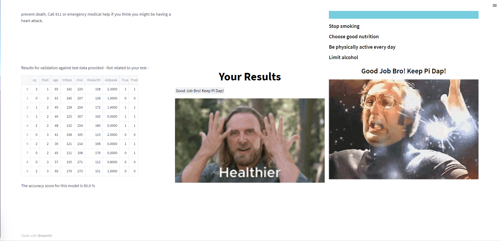
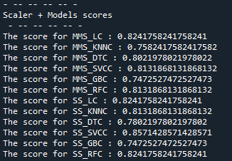
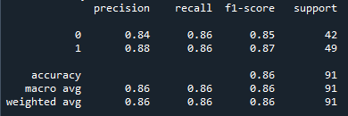

# :hospital: Heart Attack Prediction App

Analysis and developed machine learning prediction whether user has higher probability in developing heart attack.

## Description

A Data Science heart attack classification using Machine Learning and Pipelines via Scikit-Learn.

## Getting Started

### Dependencies

* Matplotlib version 3.5*
* Numpy version 1.22*
* Pandas version 1.4*
* Python version 3.8*
* Scikit-learn version 1.0*
* Scipy version 1.7*
* Seaborn 0.11*

### Datasets

* Datasets : [Heart Attack Analysis & Prediction Dataset](https://www.kaggle.com/datasets/rashikrahmanpritom/heart-attack-analysis-prediction-dataset)

### Executing model_training.py script

* Code can be clone and run directly using any IDE with the environment listed

* The script was divided into several categories such as:
   1. Data Loading
   2. Data Inspection & Visualization
   3. Data Cleaning
   4. Feature Selection
   5. Data Preprocessing
   6. Model Development
   7. Model Analysis

### Executing app.py script

* Default page

* Higher Risk Of Heart Attack

* Lower Risk Of Heart Attack

### Results

* Models score
  - Interestingly, SVC performed the best for this problem

* The classification results are as follows:

### Why is this possible?

* Lets take a step back and talk on what contribute in the success of this problem. As stated in the 'model_training.py' script, the main success of this project would be the balanced proportion between having a higher risk of heart attack and low risk of heart attack. Furthermore, the data is in the highest quality which we can directly use without affecting the model performances. Finally, kudos to [Rashik Rahman](https://www.kaggle.com/rashikrahmanpritom) for providing such a high quality datasets with detailed explanation.

### Future Works

* Despite the success of this project, there a still minor as well as major improvement can be done. Features engineering is one of them, by reconstruct or creating new features using the unselected features, we may or may not increase the model performances. Therefore, that would be our task in the near future.

* Another things is related to the Streamlit app, althought the app are able to process and formulate either user is having higher risk for getting heart attack or not, there are no database structure on the backend of the app. Therefore, the user input is not recorded hence wasting the resources. Henceforth, this will also be our goal in the future

## Acknowledgments

I would like to express my gratitude [Rashik Rahman](https://www.kaggle.com/rashikrahmanpritom) for providing a high quality datasets as well as [Kaggle](https://www.kaggle.com) which provides an excellent platform for data scientist to improve.

PEACE OUT :love_you_gesture:
